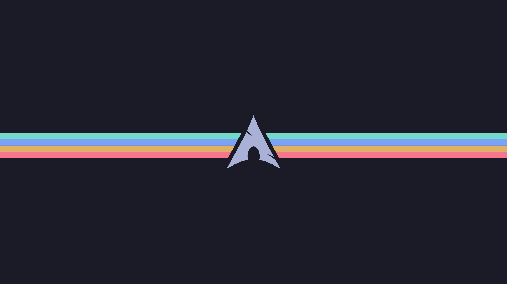
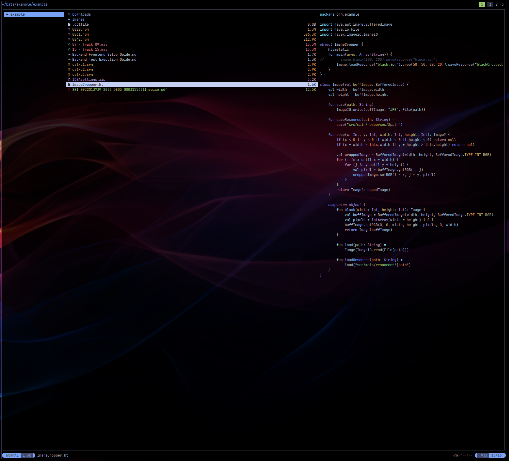

# My Personal Dotfiles: Your Gateway to a Beautiful & Productive Linux Setup

<p align="center">
  
</p>

<p align="center">
  <a href="https://github.com/your-username/my-config/stargazers"></a>
  <a href="https://github.com/your-username/my-config/issues"></a>
  <a href="https://github.com/your-username/my-config/blob/main/LICENSE"></a>
</p>

<p align="center">
  Welcome! This repository contains my personal configuration files (often called "dotfiles") designed to transform your Linux environment into a sleek, efficient, and visually stunning workspace. Everything is centered around the powerful Sway tiling window manager and a consistent, eye-pleasing **Tokyo Night** theme.
</p>

---

## Table of Contents

- [What are Dotfiles?](#what-are-dotfiles)
- [What is a Repository?](#what-is-a-repository)
- [Gallery](#gallery)
- [Key Features](#key-features)
- [Prerequisites](#prerequisites)
- [Installation Guide](#installation-guide)
- [Understanding Themes](#understanding-themes)
- [Software Configuration Overview](#software-configuration-overview)
- [License](#license)
- [Acknowledgements](#acknowledgements)

---

## What are Dotfiles?

"Dotfiles" are simply configuration files for your applications and system settings. They are usually hidden files (starting with a `.` like `.bashrc` or `.config`) that customize how your software behaves and looks. This collection of dotfiles helps you quickly set up a personalized and optimized Linux environment.

## What is a Repository?

A "repository" (or "repo") is like a project folder managed by Git, a version control system. It's where all the project's files (in this case, my dotfiles) are stored, tracked, and shared. When you "clone" a repository, you're downloading a copy of all these files to your computer.

---

## Gallery

_A picture is worth a thousand words. Here are some screenshots of the setup in action._

| Sway Desktop                                                      | Neovim                                                                                                                     | Yazi File Manager                                                                     |
| ----------------------------------------------------------------- | -------------------------------------------------------------------------------------------------------------------------- | ------------------------------------------------------------------------------------- |
|  |  |  |

---

## Key Features

- **Consistent Theming:** A unified **Tokyo Night** theme across all applications, from your terminal to your text editor and graphical applications (GTK/Qt).
- **Tiling Window Manager:** Experience a highly efficient, keyboard-driven workflow with Sway, a powerful Wayland tiling window manager.
- **Developer-Focused:** Configurations are optimized for software development, featuring popular tools like Neovim (with LazyVim), Lazygit, and Tmux.
- **Modern CLI Tools:** Enhance your command-line experience with powerful utilities like Starship (customizable prompt), Eza (modern `ls` replacement), FZF (fuzzy finder), and Yazi (terminal file manager).
- **Automated Installation:** A straightforward script to quickly deploy these dotfiles to your system.

---

## Prerequisites

<details>
<summary>Click to expand</summary>

Before you begin the installation, please ensure you have the following software installed on your system. The exact package names might vary slightly depending on your Linux distribution's package manager (e.g., `apt` for Debian/Ubuntu, `pacman` for Arch Linux, `dnf` for Fedora).

- `sway` (Wayland tiling compositor)
- `waybar` (Customizable Wayland bar)
- `neovim` (Extensible text editor)
- `ghostty` (GPU-accelerated terminal emulator)
- `zellij` (Terminal multiplexer)
- `tmux` (Terminal multiplexer)
- `bash` (The GNU Bourne-Again Shell)
- `starship` (Cross-shell prompt)
- `eza` (Modern `ls` replacement)
- `yazi` (Terminal file manager)
- `fzf` (Command-line fuzzy finder)
- `lazygit` (Git TUI)
- `rofi` or `wofi` (Application launchers)
- `dunst` (Lightweight notification daemon)
- `fastfetch` (System information tool)
- `bpytop` (Resource monitor)
- `mpv` (Media player)
- `gtk3`, `gtk4` (GTK theming engines)
- `qt5ct` (Qt5 configuration tool)
- `kanshi` (Dynamic display configuration for Wayland)
- `logid` (For Logitech devices, if applicable)
- `git` (Version control system, essential for cloning this repository)

</details>

---

## Installation Guide: Get Started in Minutes!

**Important Warning:** It is highly recommended to back up your existing configuration files before proceeding. While the installation script is designed to create backups of any files it might overwrite, performing a manual backup of your important dotfiles is always a good practice for peace of mind.

Follow these simple steps to set up your new environment:

1.  **Open your Terminal:** This is where you'll type commands. You can usually find it in your applications menu.

2.  **Install Git (if you don't have it):** Git is a tool used to download this project.
    - On Debian/Ubuntu: `sudo apt update && sudo apt install git`
    - On Arch Linux: `sudo pacman -S git`
    - On Fedora: `sudo dnf install git`

3.  **Clone this Repository:** This command downloads all the dotfiles to your computer.

    ```bash
    git clone https://github.com/your-username/my-config.git ~/.dotfiles
    ```

    - `git clone`: The command to download a repository.
    - `https://github.com/your-username/my-config.git`: The web address of this dotfiles project.
    - `~/.dotfiles`: This tells Git to save the files in a new folder named `.dotfiles` inside your home directory (`~`). The `.` makes it a hidden folder.

4.  **Navigate into the Dotfiles Directory:**

    ```bash
    cd ~/.dotfiles
    ```

    This command changes your current location in the terminal to the newly downloaded `.dotfiles` folder.

5.  **Run the Installation Script:** This script automates the process of linking the configuration files to their correct locations on your system.

    ```bash
    ./install.sh
    ```

    - `./install.sh`: This executes the `install.sh` script located in the current directory. This script will create symbolic links (shortcuts) for the configuration files, pointing to the files within your `~/.dotfiles` directory. It will also back up any existing configuration files it needs to replace.

6.  **Reboot or Log Out/In:** For all changes to take effect, it's usually best to reboot your system or at least log out and log back in.

---

## Understanding Themes

A "theme" defines the visual appearance of your applications, including colors, fonts, and overall style. In this dotfiles collection, the primary theme used is **Tokyo Night**.

- **Consistent Look:** You'll notice that many applications (like Neovim, your terminal, and GTK/Qt apps) are configured to use the Tokyo Night color scheme, providing a unified and pleasant visual experience across your entire desktop.
- **How it's applied:** The dotfiles include specific configuration entries for each application (e.g., Neovim's `colorscheme` setting, GTK CSS files) that tell them to use the Tokyo Night theme or a compatible color palette. You don't need to manually install the theme for each app; the `install.sh` script and the provided configurations handle it.

---

## Software Configuration Overview

<details>
<summary>Click to expand</summary>

This repository includes meticulously crafted settings for the following software, ensuring a cohesive and optimized experience:

| Software      | Description                                                                                              |
| ------------- | -------------------------------------------------------------------------------------------------------- |
| **Sway**      | A tiling Wayland compositor, providing efficient window management.                                      |
| **Waybar**    | A highly customizable Wayland bar for displaying system information and quick access.                    |
| **Neovim**    | A modern, highly extensible text editor, configured with LazyVim for a powerful development environment. |
| **Ghostty**   | A modern, GPU-accelerated terminal emulator for a fast and smooth command-line experience.               |
| **Zellij**    | A terminal multiplexer, allowing you to manage multiple terminal sessions in one window.                 |
| **Tmux**      | Another robust terminal multiplexer for persistent sessions and split panes.                             |
| **Bash**      | The GNU Bourne-Again Shell, your primary command-line interpreter.                                       |
| **Starship**  | A minimal, fast, and infinitely customizable prompt for your shell.                                      |
| **Eza**       | A modern, feature-rich replacement for the `ls` command, with better defaults and colors.                |
| **Yazi**      | A fast and intuitive terminal file manager.                                                              |
| **FZF**       | A command-line fuzzy finder, making it easy to search and select files or commands.                      |
| **Lazygit**   | A simple and efficient terminal UI for Git commands.                                                     |
| **Rofi/Wofi** | Versatile application launchers and menus for quick access to your programs.                             |
| **Dunst**     | A lightweight and customizable notification daemon.                                                      |
| **Fastfetch** | A fast, feature-rich tool to display system information.                                                 |
| **Bpytop**    | A visually appealing and informative resource monitor.                                                   |
| **MPV**       | A free and open-source media player.                                                                     |
| **GTK/Qt**    | Theming configurations for graphical applications built with GTK3, GTK4, and Qt5.                        |
| **Kanshi**    | A dynamic display configuration tool for Wayland, automatically adjusting your screen setup.             |
| **Logid**     | Logitech device manager for advanced features and customization (if you use Logitech peripherals).       |

</details>

---

## License

This project is licensed under the MIT License. See the [LICENSE](LICENSE) file for details.

---

## Acknowledgements

- A huge thank you to the creators of all the incredible open-source tools and projects that make this configuration possible.
- Special appreciation to the developers of the [Tokyo Night](https://github.com/folke/tokyonight.nvim) theme for their beautiful work.
